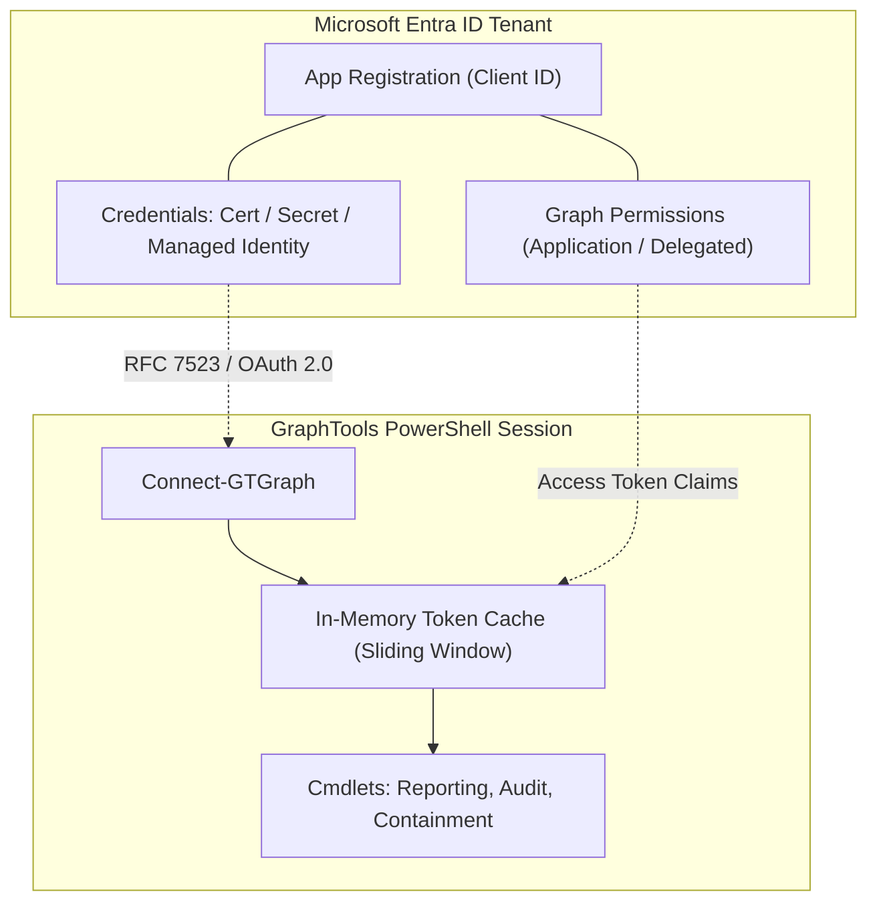

# Microsoft Entra ID App Registration Setup Guide

This guide provides end-to-end technical walkthroughs for provisioning, securing, and configuring a Microsoft Entra ID (formerly Azure AD) App Registration for use with **GraphTools**.

---

## 📋 Overview

GraphTools communicates directly with the Microsoft Graph REST API (using `https://graph.microsoft.com/v1.0` by default, with selective `https://graph.microsoft.com/beta` endpoint usage when required for advanced features like PIM governance and sign-in activities). To authenticate, GraphTools requires a registered application identity in Microsoft Entra ID configured with appropriate credentials and Microsoft Graph API permissions.



---

## 🛠️ Step 1: Create the App Registration

### Option A: Microsoft Entra Admin Center (GUI)

1. Sign in to the [Microsoft Entra admin center](https://entra.microsoft.com/) as an **Application Administrator** or **Global Administrator**.
2. Navigate to **Identity** > **Applications** > **App registrations** > **New registration**.
3. Configure application settings:
   - **Name**: `GraphTools-Automation` (or descriptive organization standard).
   - **Supported account types**: **Accounts in this organizational directory only (Single tenant)**.
   - **Redirect URI**:
     - *For background automation / certificates / client secrets*: Leave blank.
     - *For interactive browser PKCE logins (`Connect-GTGraph -Interactive`)*:
       - Select platform: **Public client/native (mobile & desktop)**.
       - URI: `http://localhost:8400/` *(Note: The trailing slash is required for exact string match)*
4. Click **Register**.
5. Record the following values displayed on the **Overview** page:
   - **Application (client) ID**: (e.g. `11111111-2222-3333-4444-555555555555`)
   - **Directory (tenant) ID**: (e.g. `aaaaaaaa-bbbb-cccc-dddd-eeeeeeeeeeee`)

### Option B: Automated Clean PowerShell Setup

> [!NOTE]
> Provisioning via Microsoft Graph PowerShell cmdlets (`Connect-MgGraph`, `New-MgApplication`) requires the `Microsoft.Graph.Applications` module on the provisioning machine. This is an optional administrative convenience for initial tenant setup; **GraphTools itself requires zero SDK modules at runtime** and operates purely over native REST.

To automate provisioning directly from PowerShell without web portal interaction, execute this clean script using the Microsoft Graph PowerShell cmdlets:

```powershell
# 1. Connect to Microsoft Graph with Application management privileges
Connect-MgGraph -Scopes "Application.ReadWrite.All" -NoWelcome

# 2. Define App Registration properties (Single-Tenant with native PKCE redirect URI)
$appParams = @{
    DisplayName    = "GraphTools-Automation"
    SignInAudience = "AzureADMyOrg"
    PublicClient   = @{
        RedirectUris = @("http://localhost:8400/")
    }
}

# 3. Create the App Registration
$app = New-MgApplication @appParams

# 4. Instantiate the Enterprise Application (Service Principal) in your tenant
$sp = New-MgServicePrincipal -AppId $app.AppId

# 5. Output identifiers for GraphTools connection
[PSCustomObject]@{
    DisplayName        = $app.DisplayName
    ApplicationId      = $app.AppId
    ObjectId           = $app.Id
    ServicePrincipalId = $sp.Id
}
```

---

## 🔐 Step 2: Configure Authentication Credentials

GraphTools supports five authentication mechanisms. Choose the credential strategy matching your deployment environment:

### Credential Matrix

| Credential Type | Best For | Security Posture | Connect Syntax |
| :--- | :--- | :--- | :--- |
| **X.509 Certificate (RFC 7523)** | Production servers, admin workstations | High (OS/DPAPI protected in certificate store; non-exportable private key recommended) | `Connect-GTGraph -TenantId $T -ClientId $C -Thumbprint $Thumb` |
| **Azure Managed Identity** | Azure VMs, Functions, Automation | Highest (Zero-credential, automatic rotation) | `Connect-GTGraph -Identity` |
| **Client Secret** | Ephemeral CI/CD runners, Docker containers | Moderate (Requires secure vaulting) | `Connect-GTGraph -TenantId $T -ClientId $C -ClientSecret $Secret` |
| **Interactive (PKCE)** | Interactive administrator troubleshooting | High (Delegated identity with MFA enforcement) | `Connect-GTGraph -Interactive -TenantId $T` |
| **Device Code** | Remote SSH sessions, Linux shells | High (Delegated identity with MFA enforcement) | `Connect-GTGraph -DeviceCode -TenantId $T` |

---

### Option A: Certificate-Based Authentication (Recommended for Security)

Certificate-based authentication uses RFC 7523 client assertions signed with asymmetric RS256 cryptography.

#### 🛡️ Security Rationale: Why Certificate Authentication is Strongly Recommended over Client Secrets

Microsoft Entra ID and GraphTools support both enterprise CA-issued certificates and self-signed X.509 certificates. Using certificate credentials instead of shared client secrets is an essential security control for enterprise environments:

1. **Elimination of Shared Secrets over the Wire**:
   - *Client secrets* are symmetric: the plaintext secret string must be transmitted in every HTTP token request (`POST /oauth2/v2.0/token`). If TLS is intercepted or reverse proxies log HTTP POST payloads, the secret is compromised.
   - *Certificates* use asymmetric cryptography: only the public key (`.cer`) is uploaded to Microsoft Entra ID. GraphTools signs an ephemeral JWT client assertion (`client_assertion`) locally using the private key. The private key **never leaves the local machine** and is never transmitted over any network.

2. **OS and Hardware-Backed Protection (Non-Exportable Keys)**:
   - When generating the certificate in the Windows Certificate Store (`Cert:\CurrentUser\My` or `Cert:\LocalMachine\My`) with `-KeyExportPolicy NonExportable`, the private key is cryptographically sealed by the Windows Data Protection API (DPAPI) or TPM.
   - Malware, memory scraping, or compromised local scripts cannot dump or export the private key.

3. **Zero Credential Leakage in Scripts, Git, and CI/CD**:
   - Client secrets frequently leak through Git commits, environment variables, task definitions, and terminal transcripts.
   - Certificate authentication references only the **SHA-1 thumbprint** (`-Thumbprint 'FC57...'`), which is non-sensitive public metadata. Leaking a thumbprint conveys zero administrative capability to an attacker.

4. **Tenant-Level Blast Radius Isolation**:
   - If an attacker compromises read access to your Microsoft Entra ID tenant (or dumps App Registration metadata), they only see the public certificate. Without physical access to the local machine holding the private key, they cannot generate access tokens or impersonate GraphTools.

5. **Replay Attack Immunity**:
   - Every client assertion generated by GraphTools includes a unique cryptographic token ID (`jti`), an issued-at timestamp (`iat`), and a strict 5-minute expiration (`exp`). Entra ID rejects replayed or expired assertions.

---

#### 1. Generate the Certificate

##### Windows (PowerShell 5.1 & PowerShell 7)
Execute the following PowerShell command on your Windows administration workstation:

```powershell
# Store location guidance:
# - 'Cert:\CurrentUser\My': Best for personal administrator workstations (isolated to user profile)
# - 'Cert:\LocalMachine\My': Best for automated scheduled tasks / shared bastion hosts

$cert = New-SelfSignedCertificate `
    -Subject "CN=GraphTools-Automation" `
    -CertStoreLocation "Cert:\CurrentUser\My" `
    -KeyExportPolicy NonExportable `
    -KeySpec Signature `
    -KeyLength 2048 `
    -KeyAlgorithm RSA `
    -HashAlgorithm SHA256 `
    -NotAfter (Get-Date).AddYears(2)

# Export the PUBLIC key only (.cer) for Microsoft Entra ID
$exportPath = "$env:TEMP\GraphTools-Automation.cer"
Export-Certificate -Cert $cert -FilePath $exportPath

[PSCustomObject]@{
    Subject    = $cert.Subject
    Thumbprint = $cert.Thumbprint
    Expires    = $cert.NotAfter
    PublicKey  = $exportPath
}
```

> [!IMPORTANT]
> Notice `-KeyExportPolicy NonExportable`. This ensures the private key is permanently locked to this workstation and cannot be exported into a `.pfx` file. `Export-Certificate` exports only the public `.cer` certificate containing zero private key material.

##### Linux & macOS Alternative (OpenSSL)
If managing GraphTools from Linux or macOS where `New-SelfSignedCertificate` is unavailable:

```bash
# Generate private key and public certificate via OpenSSL
openssl req -x509 -newkey rsa:2048 -keyout graphtools-key.pem -out GraphTools-Automation.cer -days 730 -nodes -subj "/CN=GraphTools-Automation"
```
*(On Linux/macOS, use `Connect-GTGraph -Certificate` passing a loaded `[X509Certificate2]` object or convert to PKCS#12).*

#### 2. Upload Public Certificate to Entra ID

##### GUI Method:
1. In the Entra admin center, open your App Registration.
2. Navigate to **Certificates & secrets** > **Certificates** > **Upload certificate**.
3. Select `$exportPath` (`GraphTools-Automation.cer`) and click **Add**.

##### Automated Clean PowerShell Method:
If you provisioned the application via PowerShell in Step 1, you can attach the certificate public key directly:

```powershell
# Read public certificate bytes and upload to App Registration
$certBytes = [System.IO.File]::ReadAllBytes($exportPath)
$keyCredential = @{
    Type          = "AsymmetricX509Cert"
    Usage         = "Verify"
    Key           = [System.Convert]::ToBase64String($certBytes)
    StartDateTime = $cert.NotBefore
    EndDateTime   = $cert.NotAfter
}

Add-MgApplicationKey -ApplicationId $app.Id -KeyCredential $keyCredential
```

#### 3. Connect via GraphTools

```powershell
Connect-GTGraph -TenantId 'aaaaaaaa-bbbb-cccc-dddd-eeeeeeeeeeee' `
                -ClientId '11111111-2222-3333-4444-555555555555' `
                -Thumbprint $cert.Thumbprint `
                -PassThru
```

---

### Option B: Client Secret Authentication

For headless environments without certificate access:

1. In the Entra admin center, navigate to **Certificates & secrets** > **Client secrets** > **New client secret**.
2. Add a description (e.g. `GraphTools-CI-Secret`) and set an expiration period.
3. Click **Add** and immediately copy the **Value** string (it is only shown once).
4. Connect using a `[SecureString]` to prevent memory leaks:

```powershell
$secret = Read-Host -Prompt "Enter Client Secret" -AsSecureString

Connect-GTGraph -TenantId 'aaaaaaaa-bbbb-cccc-dddd-eeeeeeeeeeee' `
                -ClientId '11111111-2222-3333-4444-555555555555' `
                -ClientSecret $secret `
                -PassThru
```

---

### Option C: Azure Managed Identity

For workloads running inside Azure (Azure Virtual Machines, Azure Functions, Azure Container Apps, Azure Automation):

1. Enable System-Assigned Managed Identity on your Azure resource, or create a User-Assigned Managed Identity.
2. Grant Microsoft Graph permissions directly to the Managed Identity service principal (see [Assigning Scopes to Managed Identities](#assigning-scopes-to-managed-identities)).
3. Connect without any client secrets or certificates:

```powershell
# System-Assigned Identity
Connect-GTGraph -Identity -PassThru

# User-Assigned Identity (by Client ID)
Connect-GTGraph -Identity -IdentityId '4f686c14-2db2-4d7d-a1fb-f1fa90432321' -IdentityType ClientId -PassThru
```

---

## 🎯 Step 3: Configure Permissions by Usage Scenario

Microsoft Graph permissions must be tailored to the exact operational scenario to enforce the **Principle of Least Privilege (PoLP)**.

In Entra ID, navigate to **API permissions** > **Add a permission** > **Microsoft Graph** > **Application permissions** (or **Delegated permissions** for interactive flows).

---

### Scenario 1: Read-Only Security Auditing & Governance

Ideal for security analysts, automated compliance auditing, and posture assessments. This profile can inspect tenant configuration, user sign-in activity, and administrative roles, but has zero modification privileges.

| Permission (Scope) | Type | Purpose / Associated Cmdlets |
| :--- | :--- | :--- |
| `AuditLog.Read.All` | Application | Audit and sign-in log analysis (`Get-GTLegacyAuthReport`, `Get-GTInactiveUser`, `Get-GTUnusedApps`, `Invoke-AuditLogQuery`) |
| `User.Read.All` | Application | User profile and activity auditing (`Get-MFAReport`, `Get-GTInactiveUser`, `Get-GTRecentUser`, `Get-GTGuestUserReport`) |
| `Reports.Read.All` | Application | Credential and MFA registration reporting (`Get-MFAReport`) |
| `Application.Read.All` | Application | Service Principal audits (`Get-GTOrphanedServicePrincipal`, `Get-GTExpiringSecrets`, `Get-GTUnusedApps`, `Get-GTRiskyAppPermissionReport`) |
| `Device.Read.All` | Application | Device hygiene audits (`Get-GTInactiveDevices`) |
| `RoleManagement.Read.Directory` | Application | Role governance (`Get-GTAdminCountReport`, `Get-GTPIMRoleReport`, `Get-GTRiskyAppPermissionReport`) |
| `Policy.Read.All` | Application | Conditional Access audits (`Get-GTPolicyControlGapReport`, `Get-GTBreakGlassPolicyReport`) |
| `Organization.Read.All` | Application | Tenant metadata & license auditing (`Get-M365LicenseOverview`, `Get-GTLicenseCostReport`) |
| `Directory.Read.All` | Application | Directory fallback reading (`Get-GTAdminCountReport`, `Get-GTPIMRoleReport`) |

---

### Scenario 2: Emergency Incident Response & Account Containment

Targeted at Security Operations Center (SOC) teams and Incident Handlers responding to compromised identities.

#### Standard Safe Containment Profile

Executes session invalidation, account disabling, password rotation, and device blocking:

| Permission (Scope) | Type | Purpose / Associated Cmdlets |
| :--- | :--- | :--- |
| `User.ReadWrite.All` | Application | Invalidate refresh tokens, disable user accounts, and rotate passwords (`Invoke-GTUserContainment`, `Revoke-GTSignOutFromAllSessions`, `Disable-GTUser`, `Reset-GTUserPassword`) |
| `Device.ReadWrite.All` | Application | Query and disable registered user devices (`Invoke-GTUserContainment`, `Disable-GTUserDevice`) |

#### Full Destructive Containment Profile (Entitlement Stripping)

Required only if invoking `Invoke-GTUserContainment -FullContainment`, `-StripEntitlements`, or `Remove-GTUserEntitlements`:

| Permission (Scope) | Type | Purpose / Associated Cmdlets |
| :--- | :--- | :--- |
| `GroupMember.ReadWrite.All` | Application | Remove user group memberships |
| `Group.ReadWrite.All` | Application | Remove user group ownerships |
| `Directory.ReadWrite.All` | Application | Strip directory-level assignments and app role assignments |
| `RoleManagement.ReadWrite.Directory` | Application | Remove directory role assignments |
| `RoleEligibilitySchedule.ReadWrite.Directory` | Application | Revoke PIM role eligibility schedules |
| `AdministrativeUnit.ReadWrite.All` | Application | Remove Administrative Unit memberships |
| `EntitlementManagement.ReadWrite.All` | Application | Remove access package assignments |
| `DelegatedPermissionGrant.ReadWrite.All` | Application | Revoke user delegated OAuth consent grants |

---

### Scenario 3: Tenant Hygiene & Lifecycle Automation

Targeted at directory lifecycle management, guest offboarding, and application hygiene:

| Permission (Scope) | Type | Purpose / Associated Cmdlets |
| :--- | :--- | :--- |
| `User.Invite.All` | Application | Remove expired pending guest invitations (`Remove-GTExpiredInvites`) |
| `User.ReadWrite.All` | Application | Update guest user lifecycle status (`Remove-GTExpiredInvites`) |
| `Application.ReadWrite.All` | Application | Remove orphaned enterprise app ownerships (`Remove-GTUserEnterpriseAppOwnership`) |
| `RoleEligibilitySchedule.ReadWrite.Directory` | Application | Clean up expired PIM eligibilities (`Remove-GTPIMRoleEligibility`) |

---

### Scenario 4: Interactive Administrator Console (Delegated Flow)

When running GraphTools interactively (`Connect-GTGraph -Interactive` or `-DeviceCode`), permissions are evaluated in the context of the signed-in user subject to both delegated scopes and tenant role assignments (e.g. Global Reader, Security Operator):

1. Under **API permissions** > **Add a permission** > **Microsoft Graph**, select **Delegated permissions**.
2. Select scopes matching the tasks you will execute interactively:
   - `User.ReadWrite.All`, `Device.ReadWrite.All`, `Reports.Read.All`, `AuditLog.Read.All`, `Policy.Read.All`, `RoleManagement.Read.Directory`.
3. Under **Authentication** > **Advanced settings**, set **Allow public client flows** to **Yes**.

---

## 🔑 Step 4: Grant Admin Consent

Application permissions in Microsoft Graph require tenant administrator consent:

1. Navigate to **API permissions** in your App Registration.
2. Click **Grant admin consent for <TenantName>**.
3. Confirm by selecting **Yes**.
4. Verify that each requested permission displays a green checkmark under the **Status** column.

---

## ⚡ Assigning Scopes to Managed Identities

Managed Identities do not have an App Registration portal interface. Assign Microsoft Graph application permissions to a Managed Identity using this clean PowerShell script:

```powershell
# Prerequisites: Connect with permission to assign app roles
Connect-MgGraph -Scopes "AppRoleAssignment.ReadWrite.All" -NoWelcome

$managedIdentityName = "my-automation-identity"
$graphAppId = "00000003-0000-0000-c000-000000000000" # Microsoft Graph Enterprise App ID

# Desired permissions for Read-Only Audit Profile
$permissions = @("AuditLog.Read.All", "User.Read.All", "Reports.Read.All", "RoleManagement.Read.Directory")

# 1. Retrieve Service Principal objects
$miSP    = Get-MgServicePrincipal -Filter "displayName eq '$managedIdentityName'"
$graphSP = Get-MgServicePrincipal -Filter "appId eq '$graphAppId'"

# 2. Assign App Roles to Managed Identity
foreach ($perm in $permissions) {
    $role = $graphSP.AppRoles | Where-Object { $_.Value -eq $perm -and $_.AllowedMemberTypes -contains "Application" }
    if ($role) {
        New-MgServicePrincipalAppRoleAssignment `
            -ServicePrincipalId $miSP.Id `
            -PrincipalId $miSP.Id `
            -ResourceId $graphSP.Id `
            -AppRoleId $role.Id | Out-Null
        Write-Host "Assigned $perm to $($miSP.DisplayName)"
    }
}
```

---

## ✅ Step 5: Test & Validate Connection

Once permissions are consented, verify connectivity and scope acquisition using GraphTools:

```powershell
# 1. Establish connection
Connect-GTGraph -TenantId "aaaaaaaa-bbbb-cccc-dddd-eeeeeeeeeeee" `
                -ClientId "11111111-2222-3333-4444-555555555555" `
                -Thumbprint "FC57D22ABE444FF1159ED82F971074D9C2443245" `
                -PassThru

# 2. Check active connection state
Get-GTConnection

# 3. Test permission acquisition (e.g. for User Audit Profile)
Test-GTGraphScopes -RequiredScopes 'AuditLog.Read.All', 'User.Read.All'

# 4. Execute test cmdlet
Get-GTRecentUser -Top 5
```

---

## 🔍 Troubleshooting Common Issues

### `AADSTS700016: Application with Identifier '...' Was Not Found in the Directory`
- **Cause**: Incorrect `ClientId` or the application was provisioned in a different tenant than `TenantId`.
- **Resolution**: Verify that the GUIDs match the App Registration Overview blade in the target tenant.

### `AADSTS700027: Client Assertion Contains an Invalid Signature`
- **Cause**: The certificate thumbprint provided to `Connect-GTGraph` does not match the certificate uploaded to Entra ID, or the certificate has expired.
- **Resolution**: Verify `$cert.Thumbprint` matches the thumbprint listed under **Certificates & secrets** in the Azure portal.

### `AADSTS50011: The Reply URL Specified in the Request Does Not Match`
- **Cause**: Occurs during `Connect-GTGraph -Interactive` when the redirect URI `http://localhost:8400/` is missing or registered without the required trailing slash in the App Registration.
- **Resolution**: Add `http://localhost:8400/` (including the trailing slash) under **Authentication** > **Mobile and desktop applications** in the Entra admin center.

### `HTTP 403 Forbidden / Authorization_RequestDenied`
- **Cause**: The application has not been granted the required Microsoft Graph permission, or admin consent was not granted.
- **Resolution**: Check the specific cmdlet documentation for required permissions. Ensure **Grant admin consent** was executed in the portal.

---

## 🔗 Related Documentation

- [`Connect-GTGraph`](Connect-GTGraph.md): Comprehensive reference for authentication parameters and token caching.
- [`Invoke-GTUserContainment`](Invoke-GTUserContainment.md): 5-step incident response orchestrator documentation.
- [`User-Security-Response`](User-Security-Response.md): Detailed incident containment guide.
- [`Zero-Dependency-REST-Architecture`](Zero-Dependency-REST-Architecture.md): Architecture specifications of the REST engine.
