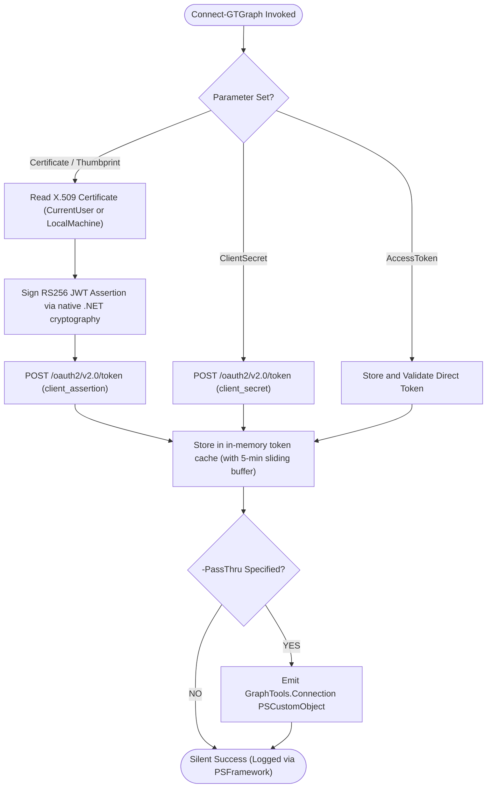

# Connect-GTGraph

## 🌟 Overview

`Connect-GTGraph` provides **zero-dependency authentication** to Microsoft Graph for the `GraphTools` module. It eliminates the requirement for the heavyweight `Microsoft.Graph.Authentication` SDK module by utilizing native .NET cryptographic primitives and standard HTTP REST endpoints.

Authentication tokens are cached in-memory with a sliding expiration buffer to prevent repeated token requests and avoid Entra ID token endpoint throttling (HTTP 429).

---

## 🔐 Supported Authentication Flows

### 1. Certificate-Based Client Credentials (RFC 7523)
Signs a JSON Web Token (JWT) client assertion using a private key from the Windows Certificate Store (`Cert:\LocalMachine\My` or `Cert:\CurrentUser\My`) or an explicit `X509Certificate2` object. The private key remains hardware/DPAPI protected and is never exported.

```powershell
Connect-GTGraph -TenantId $TenantId -ClientId $ClientId -Thumbprint $CertThumbprint
```

### 2. Client Secret Credentials
For containerized or CI/CD automation workloads where certificate infrastructure is unavailable:

```powershell
Connect-GTGraph -TenantId $TenantId -ClientId $ClientId -ClientSecret $Secret
```

### 3. Direct Access Token Passthrough
Allows re-using a pre-acquired Bearer token (e.g. from Azure CLI, GitHub Actions OIDC, or external runners):

```powershell
Connect-GTGraph -AccessToken $BearerToken
```



---

## ⚙️ Parameters

| Parameter | Type | Set | Description |
| :--- | :--- | :--- | :--- |
| `-TenantId` | `string` | Cert / Secret | Microsoft Entra ID Tenant / Directory ID. |
| `-ClientId` | `string` | Cert / Secret | Application (Client) ID of the registered app. |
| `-Thumbprint` | `string` | Certificate | SHA-1 thumbprint of the certificate in the local store. |
| `-Certificate` | `X509Certificate2` | CertObject | Direct X.509 certificate object with private key. |
| `-ClientSecret` | `string` | ClientSecret | Application client secret. |
| `-AccessToken` | `string` | AccessToken | Raw Bearer access token string. |
| `-Scope` | `string` | All | OAuth 2.0 scope (defaults to `https://graph.microsoft.com/.default`). |
| `-PassThru` | `switch` | All | Emits the connection summary object to the pipeline. |

---

## 📊 Pipeline Output

When `-PassThru` is specified, `Connect-GTGraph` emits a strongly-typed `[PSCustomObject]`:

```powershell
TypeName: GraphTools.Connection

Name       MemberType   Definition
----       ----------   ----------
Connected  NoteProperty bool Connected=True
TenantId   NoteProperty string TenantId=fa8b2a79-cd59-468b-a25d-a6fef0b4dad1
ClientId   NoteProperty string ClientId=23f82714-715c-41d1-af75-e89e3078b90a
AuthType   NoteProperty string AuthType=Certificate
Scope      NoteProperty string Scope=https://graph.microsoft.com/.default
ExpiresAt  NoteProperty DateTime ExpiresAt=2026-09-21 19:25:40
```

---

## 🔄 Related Cmdlets

- [`Disconnect-GTGraph`](file:///C:/tools/personal/git/GraphTools/functions/Disconnect-GTGraph.ps1): Clears connection configuration and flushes cached tokens.
- [`Get-GTConnection`](file:///C:/tools/personal/git/GraphTools/functions/Get-GTConnection.ps1): Inspects active connection state and token validity.
- [`Invoke-GTGraphRequest`](file:///C:/tools/personal/git/GraphTools/internal/functions/Invoke-GTGraphRequest.ps1): Executes REST queries using the cached connection.
