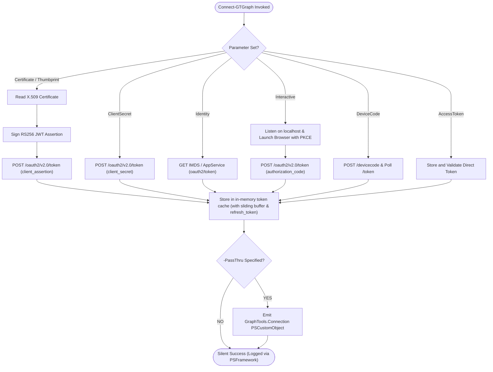

# Connect-GTGraph

## 🌟 Overview

`Connect-GTGraph` provides **zero-dependency authentication** to Microsoft Graph for the `GraphTools` module. It eliminates the requirement for the heavyweight `Microsoft.Graph.Authentication` SDK module by utilizing native .NET cryptographic primitives and standard HTTP REST endpoints.

Authentication tokens are cached in-memory with a sliding expiration buffer to prevent repeated token requests and avoid Entra ID token endpoint throttling (HTTP 429). For interactive and device code sessions, `refresh_token` grants are stored and used for seamless silent renewal.

---

## 🔐 Supported Authentication Flows

### 1. Certificate-Based Client Credentials (RFC 7523)
Signs a JSON Web Token (JWT) client assertion using a private key from the Windows Certificate Store (`Cert:\LocalMachine\My` or `Cert:\CurrentUser\My`) or an explicit `X509Certificate2` object. The private key remains hardware/DPAPI protected and is never exported.

```powershell
Connect-GTGraph -TenantId $TenantId -ClientId $ClientId -Thumbprint $CertThumbprint
```

### 2. Client Secret Credentials (String & SecureString)
For containerized or automation workloads where certificate infrastructure is unavailable. Supports both plaintext `[string]` and encrypted `[System.Security.SecureString]`:

```powershell
# Plaintext string
Connect-GTGraph -TenantId $TenantId -ClientId $ClientId -ClientSecret $Secret

# SecureString (unsecured in-memory only in-flight during HTTP calls)
$secureSecret = Read-Host -AsSecureString
Connect-GTGraph -TenantId $TenantId -ClientId $ClientId -ClientSecret $secureSecret
```

### 3. Azure Managed Identity (System-Assigned & User-Assigned)
Authenticates without secrets in Azure VMs, Azure App Services, Azure Functions, Container Apps, or Azure Automation via the Instance Metadata Service (IMDS) or environment endpoints:

```powershell
# System-Assigned Managed Identity
Connect-GTGraph -Identity

# User-Assigned Managed Identity (by Client ID)
Connect-GTGraph -Identity -IdentityId '4f686c14-2db2-4d7d-a1fb-f1fa90432321' -IdentityType ClientId

# User-Assigned Managed Identity (by Resource ID)
Connect-GTGraph -Identity -IdentityId '/subscriptions/.../userAssignedIdentities/myUAMI' -IdentityType ResourceId
```

### 4. Interactive Browser Authentication with PKCE
Performs OAuth 2.0 Authorization Code flow with Proof Key for Code Exchange (PKCE) using a local HTTP listener on `http://localhost:$LocalPort/`. Automatically opens the default browser and captures credentials, storing the `refresh_token` for automated silent renewal:

```powershell
Connect-GTGraph -Interactive -TenantId $TenantId
```

### 5. Device Code Authentication
Authenticates using the OAuth 2.0 Device Authorization Grant. Ideal for headless Linux/container environments, remote SSH/PowerShell sessions, or restricted CLI terminals:

```powershell
Connect-GTGraph -DeviceCode -TenantId $TenantId
```

### 6. Direct Access Token Passthrough
Allows re-using a pre-acquired Bearer token (e.g. from Azure CLI, external identity providers, or CI runners):

```powershell
Connect-GTGraph -AccessToken $BearerToken
```



---

## ⚙️ Parameters

| Parameter | Type | Set | Description |
| :--- | :--- | :--- | :--- |
| `-TenantId` | `string` | Cert / Secret / Interactive / DeviceCode | Microsoft Entra ID Tenant ID, domain, or `'organizations'`. |
| `-ClientId` | `string` | Cert / Secret / Interactive / DeviceCode | Application (Client) ID. Defaults to Microsoft Graph CLI in Interactive/DeviceCode. |
| `-Thumbprint` | `string` | Certificate | SHA-1 thumbprint of the certificate in the local store. |
| `-Certificate` | `X509Certificate2` | CertObject | Direct X.509 certificate object with private key. |
| `-ClientSecret` | `object` | ClientSecret | Client secret (`[string]` or `[SecureString]`). |
| `-Identity` | `switch` | Identity | Connects via current Azure Managed Identity. |
| `-IdentityId` | `string` | Identity | Identifier for User-Assigned Managed Identity. |
| `-IdentityType` | `string` | Identity | Identifier type: `'ClientId'`, `'ResourceId'`, `'PrincipalId'`. |
| `-Interactive` | `switch` | Interactive | Initiates interactive browser login with PKCE. |
| `-LocalPort` | `int` | Interactive | Local HTTP port for redirect callback (defaults to `8400`). |
| `-DeviceCode` | `switch` | DeviceCode | Initiates device code authentication flow. |
| `-AccessToken` | `string` | AccessToken | Raw Bearer access token string. |
| `-Scope` | `string` | All | OAuth 2.0 scope (defaults to `https://graph.microsoft.com/.default`). |
| `-PassThru` | `switch` | All | Emits the connection summary object to the pipeline. |

---

## 📊 Pipeline Output

When `-PassThru` is specified, `Connect-GTGraph` emits a strongly-typed `[PSCustomObject]`:

```powershell
TypeName: GraphTools.Connection

Name                 MemberType   Definition
----                 ----------   ----------
Connected            NoteProperty bool Connected=True
TenantId             NoteProperty string TenantId=fa8b2a79-cd59-468b-a25d-a6fef0b4dad1
ClientId             NoteProperty string ClientId=14d82eec-204b-4a57-bc6d-141461f58e68
AuthType             NoteProperty string AuthType=Interactive
Scope                NoteProperty string Scope=https://graph.microsoft.com/.default
ExpiresAt            NoteProperty DateTime ExpiresAt=2026-09-25 11:30:00
IdentityId           NoteProperty string IdentityId=
IdentityType         NoteProperty string IdentityType=
RefreshTokenPresent  NoteProperty bool RefreshTokenPresent=True
```

---

## 🔄 Related Cmdlets

- [`Disconnect-GTGraph`](../functions/Disconnect-GTGraph.ps1): Clears connection configuration and flushes cached tokens.
- [`Get-GTConnection`](../functions/Get-GTConnection.ps1): Inspects active connection state, identity metadata, and token validity.
- [`Invoke-GTGraphRequest`](../internal/functions/Invoke-GTGraphRequest.ps1): Executes REST queries using the cached connection.
