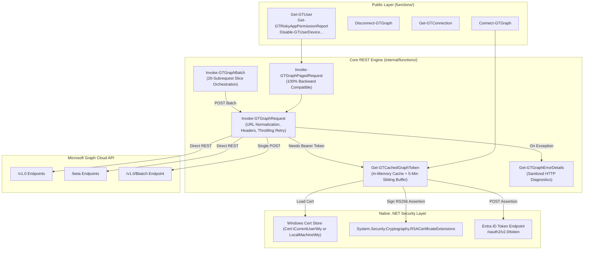
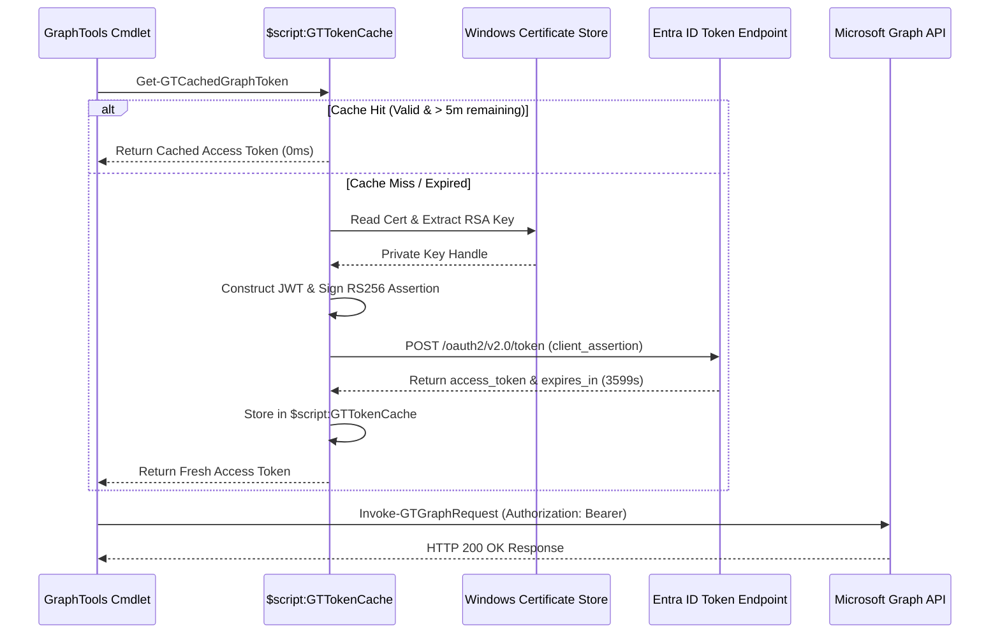
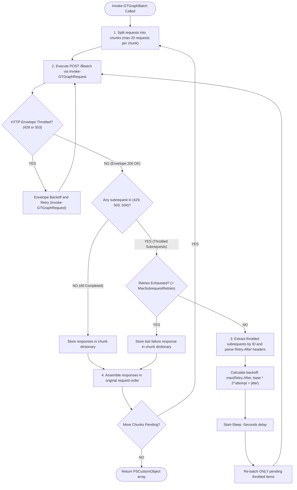

# Zero-Dependency Microsoft Graph REST Engine Architecture

> [!Summary] Architectural specification and migration documentation for GraphTools' zero-dependency REST engine. Replaces the external `Microsoft.Graph.*` SDK modules with native .NET cryptographic primitives, RFC 7523 client assertions, sliding token cache buffers, resilient HTTP 429 throttling recovery, and `$batch` request orchestration.

---

## 1. Executive Summary & Problem Statement

Historically, PowerShell utilities targeting the Microsoft Graph API have relied on the official `Microsoft.Graph` PowerShell SDK. In enterprise, security, and air-gapped automation contexts, this dependency introduces critical engineering hurdles:

1. **Heavy Footprint & Cold Starts:** The full Microsoft Graph SDK spans 40+ sub-modules and hundreds of megabytes on disk. Module imports can take several seconds, heavily degrading cold-start performance in Azure Functions, CI/CD runners, and unattended scheduled tasks.
2. **Environment & Gallery Lockout:** Calling `Install-Module` or dynamic PSGallery resolution inside locked, non-internet-connected, or strictly proxied enterprise runtimes fails or triggers audit alerts.
3. **Throttling Exposure (HTTP 429):** Requesting access tokens on every execution without persistent caching quickly leads to Entra ID token endpoint throttling (HTTP 429), resulting in failed batch jobs.
4. **Version Breaking Changes:** Rapid API SDK major version shifts (v1 to v2) introduce signature drift and breaking cmdlet renames.

GraphTools solves these architectural challenges by completely removing runtime dependencies on `Microsoft.Graph.*`. All Graph operations are executed through a **pure .NET and PowerShell REST engine** natively compatible with both **Windows PowerShell 5.1** and **PowerShell 7.x**.

---

## 2. Comparative Benchmark

| Capability | Microsoft Graph SDK (`Microsoft.Graph.*`) | GraphTools Zero-Dependency REST Engine |
| :--- | :--- | :--- |
| **External Dependencies** | Requires 40+ SDK submodules (~500MB+) | **Zero external dependencies** (pure .NET + `PSFramework`) |
| **Module Import Latency** | ~2.5s – 8.0s | **< 40ms** (near-instantaneous) |
| **Authentication Flow** | Abstracted SDK credential providers | **RFC 7523 Client Assertion (RS256)** via native DPAPI/CNG store |
| **Token Caching** | Black-box MSAL cache | **In-memory sliding buffer** (`$script:GTTokenCache`), 0ms hit |
| **Throttling Resilience** | Opaque SDK retry handler | **Inspects `Retry-After` header** with exponential backoff & jitter |
| **Pagination** | `-All` parameter often loads full sets into memory | **`@odata.nextLink` traversal** via `List[object]` accumulation |
| **Batching ($batch)** | `Invoke-MgGraphRequest` or custom JSON payload | **`Invoke-GTGraphBatch`** with automatic 20-slice chunking |
| **Endpoint Agility** | Locked to installed cmdlet definitions | Immediate access to any `/v1.0` or `/beta` resource |

---

## 3. High-Level Engine Architecture



---

## 4. Cryptographic Authentication: RFC 7523 Client Assertion

Rather than storing plaintext client secrets, enterprise systems should authenticate using hardware- or DPAPI-protected certificates.

### Token Request Lifecycle
1. **Certificate Discovery:** [`Get-GTCachedGraphToken`](../internal/functions/Get-GTCachedGraphToken.ps1) resolves the target certificate from `Cert:\LocalMachine\My` or `Cert:\CurrentUser\My` by thumbprint.
2. **Key Extraction:** Extracts the RSA private key via `[System.Security.Cryptography.X509Certificates.RSACertificateExtensions]::GetRSAPrivateKey($cert)`. The key remains protected inside Windows CNG/CAPI and is never exported.
3. **JWT Header (`alg=RS256`, `typ=JWT`, `x5t`):** Converts the certificate thumbprint hex string into a raw SHA-1 byte array and Base64Url encodes it into the `x5t` header claim.
4. **JWT Payload Claims:**
   - `aud`: `https://login.microsoftonline.com/{tenantId}/oauth2/v2.0/token`
   - `iss`: `{clientId}`
   - `sub`: `{clientId}`
   - `jti`: `[Guid]::NewGuid().ToString()` (prevents replay attacks)
   - `nbf`: Epoch timestamp
   - `exp`: Epoch timestamp + 300 seconds (short-lived assertion validity)
5. **Cryptographic Signing:** Concatenates `header.payload` and signs using SHA-256 and PKCS#1 padding.
6. **Token POST:** Emits `client_credentials` grant with `client_assertion_type = urn:ietf:params:oauth:client-assertion-type:jwt-bearer`.



---

## 5. Core Engine Components

### A. Token Manager ([`Get-GTCachedGraphToken.ps1`](../internal/functions/Get-GTCachedGraphToken.ps1))
* **In-Memory Cache:** `$script:GTTokenCache` maintains the active `AccessToken`, `ExpiresAt`, `TenantId`, `ClientId`, and `AuthType`.
* **Sliding Refresh Buffer (`$BufferMinutes = 5`):** Standard Entra tokens expire after 60 minutes (3599 seconds). When remaining validity drops below 5 minutes, a fresh token is requested proactively to avoid in-flight request expiration.
* **Authentication Fallbacks:**
  1. RFC 7523 Certificate thumbprint or direct `X509Certificate2` object.
  2. Client Secret credentials.
  3. Direct Bearer token passthrough.
  4. Automatic adoption of active interactive SDK sessions if present in the runspace.

### B. Central REST Invoker ([`Invoke-GTGraphRequest.ps1`](../internal/functions/Invoke-GTGraphRequest.ps1))
* **URI Normalization:** Transparently accepts relative endpoints (`v1.0/users`, `beta/servicePrincipals`) and resolves them to fully qualified URIs.
* **Header Standardization:** Injects `Authorization`, `client-request-id` (UUID), `Accept = application/json`, and user-provided headers (such as `ConsistencyLevel = eventual`).
* **Pagination (`-All`):** Recursively follows `@odata.nextLink` until exhausted, using high-performance `[System.Collections.Generic.List[object]]` accumulation.
* **Resilience & Throttling (HTTP 429/503):**
  - Catches HTTP `429` (Too Many Requests) and `503` (Service Unavailable).
  - Inspects and parses the `Retry-After` header across both Windows PowerShell 5.1 and PowerShell 7.x.
  - Automatically falls back to exponential backoff with jitter if `Retry-After` is missing:
    $$\text{Delay} = (\text{RetryBaseDelaySeconds} \times 2^{\text{attempt}}) + \text{random}(1, 3)$$
  - Retries up to `$MaxRetries` before failing.
* **Diagnostics Integration:** All non-transient exceptions are piped directly into [`Get-GTGraphErrorDetails`](../internal/functions/Get-GTGraphErrorDetails.ps1) for safe, enumeration-resistant error reporting.

### C. JSON Batch Orchestrator ([`Invoke-GTGraphBatch.ps1`](../internal/functions/Invoke-GTGraphBatch.ps1))
* Microsoft Graph supports combining up to 20 subrequests into a single `POST https://graph.microsoft.com/v1.0/$batch`.
* **Chunking Engine:** Slices arbitrary numbers of requests (e.g. 100 requests) into sequential chunks of 20, executing each batch through `Invoke-GTGraphRequest`.
* **Two-Tiered Throttling & Error Handling:**
  - **Envelope Level:** HTTP 429/503 on the root batch request is handled transparently with exponential backoff by `Invoke-GTGraphRequest`.
  - **Subrequest Level:** Microsoft Graph returns `HTTP 200 OK` for the batch envelope even when individual subrequests return `429 Too Many Requests` or `503 Service Unavailable`. `Invoke-GTGraphBatch` scans each subrequest response, extracts subrequest-specific `Retry-After` headers, and automatically isolates and re-batches *only* the throttled subrequests up to `$MaxSubrequestRetries` (default: 3) with jittered backoff.
  - **Missing Response Fallback:** Any subrequest dropped by the Graph batch endpoint is caught and re-attempted, or returned with structured `MissingBatchResponse` diagnostics.
* **Correlated Responses:** Preserves the original subrequest sequence and returns strongly typed `GraphTools.BatchResponse` objects containing `Id`, `Status`, `Headers`, and parsed `Body`.



### D. Compatibility Bridge ([`Invoke-GTGraphPagedRequest.ps1`](../internal/functions/Invoke-GTGraphPagedRequest.ps1))
* Existing cmdlets in GraphTools (over 40 call sites) call `Invoke-GTGraphPagedRequest`.
* Refactored into a pass-through delegating directly to `Invoke-GTGraphRequest -All`, immediately providing the entire module with the benefits of the new REST engine without rewriting individual public functions.

---

## 6. Public Cmdlet Usage Guide

### 1. Connecting to Microsoft Graph ([`Connect-GTGraph`](Connect-GTGraph.md))

```powershell
# Certificate-based authentication (Recommended for enterprise / scheduled tasks)
Connect-GTGraph -TenantId "fa8b2a79-cd59-468b-a25d-a6fef0b4dad1" `
                -ClientId "af20edf7-7120-4dbd-af20-e1e58e49b0ff" `
                -Thumbprint "FC57D22ABE444FF1159ED82F971074D9C2443245" `
                -PassThru

# Client Secret authentication (For CI/CD or containers)
Connect-GTGraph -TenantId $TenantId -ClientId $ClientId -ClientSecret $Secret

# Direct Token passthrough
Connect-GTGraph -AccessToken $BearerToken
```

### 2. Inspecting Connection Status ([`Get-GTConnection`](../functions/Get-GTConnection.ps1))

```powershell
Get-GTConnection
```

*Output:*
```powershell
TypeName: GraphTools.ConnectionStatus

Connected : True
TenantId  : fa8b2a79-cd59-468b-a25d-a6fef0b4dad1
ClientId  : af20edf7-7120-4dbd-af20-e1e58e49b0ff
AuthType  : Certificate
Scope     : https://graph.microsoft.com/.default
ExpiresAt : 2026-09-21 19:54:53
TimeUtc   : 2026-09-21T17:55:00.0000000Z
```

### 3. Disconnecting & Cache Purge ([`Disconnect-GTGraph`](../functions/Disconnect-GTGraph.ps1))

```powershell
Disconnect-GTGraph -PassThru
```

---

## 7. Migration Checklist for Function Authors

When authoring new cmdlets or refactoring legacy ones:

1. **Remove SDK Module Imports:** Do not call `Install-GTRequiredModule` for `Microsoft.Graph.*` modules.
2. **Eliminate SDK Cmdlets:** Replace `Get-Mg*`, `Update-Mg*`, `New-Mg*`, `Remove-Mg*` with direct calls to `Invoke-GTGraphRequest` or `Invoke-GTGraphPagedRequest`.
3. **Use Relative Resource URIs:** Pass relative paths such as `v1.0/users` or `beta/servicePrincipals`.
4. **Leverage Automatic Pagination:** Add `-All` to `Invoke-GTGraphRequest` whenever retrieving collections.
5. **Batch Bulk Lookups:** When resolving multiple individual objects (e.g. resolving 50 user profiles by ID), assemble an array of requests and pass them to `Invoke-GTGraphBatch` to reduce network roundtrips by up to 95%.

---

## 8. Related Documentation

- [[Connect-GTGraph]]
- [[Technical-Highlights]]
- [[Get-GTRiskyAppPermissionReport]]
- [[Conditional-Access-Analysis]]
